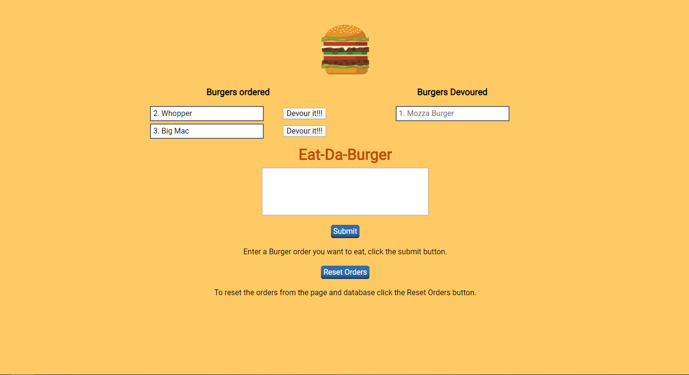

# MVC-Eat-Da-Burger
Assignment 11 for UfT fullstack bootcamp focusing on making an MVC app using node, express, handlebars and mysql.

Steps in site revolve around using  crud operators.

Create: using the form
Read: Diplay the data in the view
Update: With devour button.
Delete: In this instance isn't used.

Live Link at: https://eat-all-da-burger.herokuapp.com/

